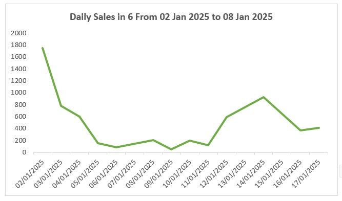
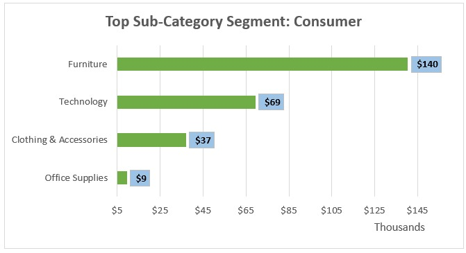
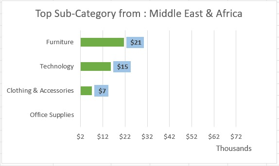

# 📊 Global Sales Analysis (Intermediate Excel Interactive Charts)

## 📌 Project Overview
Proyek ini menganalisis data penjualan *Global E-Commerce* (2.000 transaksi) menggunakan fitur-fitur **Intermediate Excel** untuk menghasilkan visualisasi data yang dinamis dan interaktif tanpa kode (*code-free interactivity*).

## 🛠️ Excel Features & Techniques Used
* **Data Preparation:** Cleaned Raw Data & Staging Tables (`Data_Preparation`).
* **Form Controls Interactivity:**
  * **Scroll Bar & Spinner Button:** Navigasi rentang tanggal penjualan harian secara fleksibel.
  * **Radio / Option Buttons:** Switch visualisasi top sub-category berdasarkan segmen pelanggan (*Consumer*, *Corporate*, *Home Office*).
* **Data Validation:** Dropdown list interaktif untuk memfilter top sub-category berdasarkan wilayah (*Region*).
* **Formulas & Functions:** `INDEX`, `MATCH`, `OFFSET`, `SUMIFS`, dan pencarian tanggal dinamis.

## 📈 Interactive Charts Showcase

### 1. Dynamic Daily Sales Chart (Scroll Bar & Spinner)
Grafik tren penjualan harian yang menyesuaikan tanggal awal dan durasi hari berdasarkan input Scroll Bar dan Spinner.

### 2. Segment Comparison Chart (Radio Button)
Grafik sub-kategori teratas yang berganti secara otomatis saat segmen pelanggan dipilih.

### 3. Regional Analysis Chart (Data Validation)
Grafik sub-kategori teratas yang terintegrasi dengan filter dropdown wilayah.

## 📁 Repository Structure
* `Global_Sales_Analysis_Intermediate_Excel.xlsx` : File kerja utama Excel.
* `Raw Data` : Dataset mentah (2.000 baris).
* `Data Preparation` : Sheet pendukung rumus & tabel agregasi.
* `Dynamic_Chart_FormControl` & `InteractiveChart_DataValidation` : Sheet visualisasi utama.
